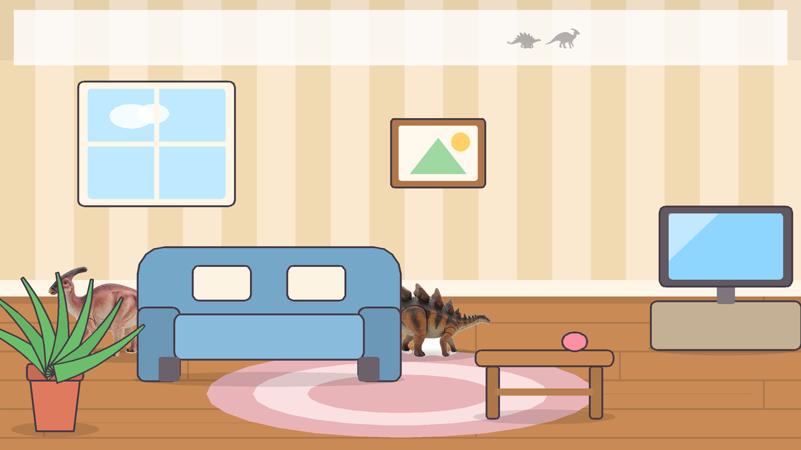

# 공룡을 찾아라! 🦕

집 안 여러 방에 숨은 공룡을 찾는, 아주 어린 아이를 위한 게임입니다.
**누르기만 하면 되고, 실패도 시간 제한도 없습니다.**



## 어떻게 노나요

1. `시작!` 을 누릅니다. (화면 아무 데나 눌러도 시작돼요)
2. 방 안에 공룡이 숨어 있어요. 소파 뒤, 탁자 아래, 바구니 뒤…
3. 공룡을 찾아서 **콕 누르면** 공룡이 폴짝 뛰며 반짝반짝 좋아합니다.
4. 찾은 공룡의 **큰 그림과 이름이 3초 동안** 화면에 뜹니다 — "티라노사우루스!"
5. 그 방의 공룡을 다 찾으면 "잘했어요!" 와 함께 **다음 탄**으로 갑니다.
6. **끝이 없습니다.** 1~6탄은 우리 집(거실 → 부엌 → 침실 → 욕실 → 놀이방 → 다락방),
   7탄부터는 서재·별빛방·사탕방·우주방… 매번 새로 꾸며진 방이 계속 나옵니다.
   100탄이든 300탄이든 이어서 할 수 있어요.

- **10탄마다** "20탄 돌파!" 하고 색종이가 쏟아집니다.
- 공룡 수는 조금씩 늘어납니다 — 2마리로 시작해서 15탄쯤부터 5마리.
- **몇 탄까지 갔는지 저장됩니다.** 다음에 켜면 첫 화면에 `최고 기록 23탄` 이 뜨고,
  `23탄부터` 버튼으로 이어서 할 수 있습니다. (`처음부터` 하려면 `시작!`)

공룡은 **50종**입니다.

- **큰 육식** 티라노사우루스 · 기가노토사우루스 · 스피노사우루스 · 알로사우루스 ·
  카르노타우루스 · 케라토사우루스 · 딜로포사우루스 · 테리지노사우루스
- **랍토르** 벨로키랍토르 · 데이노니쿠스 · 유타랍토르 · 미크로랍토르 · 트로오돈 ·
  콤프소그나투스 · 오비랍토르 · 갈리미무스 · 오르니토미무스
- **목 긴 공룡** 브라키오사우루스 · 디플로도쿠스 · 아파토사우루스 · 브론토사우루스 ·
  카마라사우루스 · 마멘키사우루스 · 아르젠티노사우루스
- **뿔·프릴** 트리케라톱스 · 프로토케라톱스 · 스티라코사우루스 · 파키리노사우루스 · 토로사우루스
- **등판·갑옷** 스테고사우루스 · 켄트로사우루스 · 안킬로사우루스 · 노도사우루스 · 디메트로돈
- **오리주둥이** 파라사우롤로푸스 · 코리토사우루스 · 람베오사우루스 · 에드몬토사우루스 ·
  이구아노돈 · 마이아사우라 · 파키케팔로사우루스
- **하늘** 프테라노돈 · 케찰코아틀루스 · 람포링쿠스 · 디모르포돈 · 시조새
- **바다** 모사사우루스 · 플레시오사우루스 · 엘라스모사우루스 · 이크티오사우루스

- 빈 곳이나 가구를 눌러도 괜찮아요. 가구가 살짝 흔들릴 뿐, 틀렸다고 혼내지 않습니다.
- 12초 동안 못 찾으면 남은 공룡이 살짝 꿈틀거려서 힌트를 줍니다.
- 공룡이 숨는 자리는 할 때마다 바뀌어서, 다시 해도 새롭습니다.

## 실행 방법

Godot 4 (4.4 이상, 개발/확인은 4.7.1에서 했습니다) 이 필요합니다.

```bash
./run.sh
# 또는
godot --path /home/dgxmaruta/pjt/dino
```

Godot 편집기에서 열려면: 편집기 → `가져오기` → 이 폴더의 `project.godot` 선택.

### 안드로이드 (폰/태블릿)

```bash
mkdir -p build/android && godot --headless --path . \
    --export-debug "Android Test APK" "$PWD/build/android/dinofind-test.apk"
adb install -r build/android/dinofind-test.apk
```

가로 화면(어느 쪽으로 눕혀도 됨), 몰입 모드(위아래 상태바 숨김), 터치로 바로 놀 수 있습니다.
화면 비율이 16:9 가 아닌 폰에서는 양옆에 옅은 크림색 여백이 생깁니다.

### 아이폰 / 아이패드

맥이 없어도 GitHub Actions 의 맥 머신이 IPA 를 만들어 줍니다.
`export_presets.cfg` 의 `iOS` 프리셋과 `.github/workflows/ios.yml` 이 그 일을 합니다.

```bash
# 리눅스에서는 Xcode 프로젝트까지만 나옵니다 (IPA 는 맥에서만)
godot --headless --path . --export-release "iOS" "$PWD/build/ios/dinofind.ipa"
```

애플 개발자 계정이 없어도 서명 없는 IPA 를 받아 Sideloadly/AltStore 로 넣을 수 있습니다.
순서는 [`IOS.md`](IOS.md) 에 하나하나 적어 뒀습니다.

### 어른용 조작

| 키 / 버튼 | 하는 일 |
|---|---|
| `F11` | 전체화면 (아이가 다른 창을 누르지 못하게) |
| `ESC` | 전체화면 끄기 |
| 화면 위 `소리 켜짐/꺼짐` | 효과음 끄고 켜기 |
| 화면 위 `처음으로` | 첫 화면으로 |

## 폴더 구조

```
project.godot        게임 설정
main.tscn            시작 장면 (스크립트만 붙어 있음)
icon.svg             아이콘
fonts/DinoKR.ttf     한글 글꼴 (Noto Sans CJK KR 에서 필요한 글자만 추림)
assets/dinos/*.png   공룡 50종 그림 (Krea 2 로 생성, 배경 투명)
scripts/
  game.gd            게임 전체 흐름 (제목 → 무한 스테이지, 찾은 공룡 카드, 기록 저장)
  rooms.gd           손으로 꾸민 1~6탄 설계도 + 숨은 정도 계산
  room_gen.gd        7탄부터 방을 새로 만들어 내는 곳 (테마 26가지 + 가구 22종)
  room_bg.gd         벽지와 바닥
  prop.gd            가구/소품 그림 (소파, 침대, 흔들말 …)
  dino_species.gd    공룡 50종 목록 (이름, 키, 그림, 반짝이 색)
  dino.gd            공룡 한 마리의 움직임과 클릭 판정
  dino_art.gd        도형 도우미 + 그림 파일이 없을 때 쓰는 손그림 공룡
  dino_row.gd        화면 위 "몇 마리 찾았나" 표시
  confetti.gd        반짝이와 색종이
  sfx.gd             효과음 (파일 없이 코드로 소리를 만듭니다)
android_icons/       런처 아이콘 (tools/render_preview.py 가 만들어 줍니다)
export_presets.cfg   안드로이드 익스포트 설정
preview/             각 방의 미리보기 그림
tools/               개발용 도구 (아래 참고)
```

방(벽지·바닥·가구)과 효과음은 **파일 없이 전부 코드로** 만듭니다. 공룡 그림만 이미지 파일입니다.

공룡은 **실제 공룡을 피규어로 만든 것처럼** 그렸습니다. 만화체로 뽑으면 종끼리 다 비슷해져서
아이가 티라노와 알로사우루스를 구분하지 못했는데, 피규어 화풍으로 바꾸니 뿔·등판·볏·발톱이
또렷하게 보입니다. 그림책 같은 방 안에 진짜 공룡 장난감이 놓여 있는 모양새가 됩니다.

### 공룡 그림 다시 만들기

이 컴퓨터에 설치된 로컬 **Krea 2** 로 생성합니다 (GPU, 16종에 약 20분).

```bash
python3 tools/gen_dinos.py --list                     # 뭘 만드는지 목록
python3 tools/gen_dinos.py                            # 없는 것만 생성 (종당 약 1분)
python3 tools/gen_dinos.py --only trex --force        # 마음에 안 드는 것만 다시
python3 tools/check_species.py                        # 두 목록이 어긋나지 않았는지 확인
```

흰 배경으로 생성한 뒤 배경을 지워 투명 PNG 로 저장합니다. 스튜디오 사진처럼 발밑에 옅은
그림자가 깔리므로, 단순히 흰색만 지우지 않고 **색이 있거나 어두운 픽셀을 피규어로 보고
벽을 세운 뒤** 바깥에서 채워 들어옵니다(`cut_out()`). 종류·이름·크기·프롬프트는
`tools/gen_dinos.py` 의 `DINOS` 목록 하나에 모여 있고, 게임 쪽 목록은
`scripts/dino_species.gd` 입니다. **그림이 없어도 게임은 손그림 공룡으로 돌아갑니다.**

### 바꿔보기 쉬운 것들

- 탄마다 공룡 수: `scripts/room_gen.gd` 의 `dino_count()` (1~6탄은 `rooms.gd` 의 `"count"`)
- 방 이름 목록: `scripts/room_gen.gd` 의 `THEMES`
- 자동 생성 방에 나올 가구: `scripts/room_gen.gd` 의 `CATALOG`
- 공룡 이름/키: `scripts/dino_species.gd` 의 `LIST`
- 찾았을 때 카드가 떠 있는 시간: `scripts/game.gd` 의 `_show_card()`
- 힌트가 나오기까지의 시간: `scripts/game.gd` 의 `idle > 12.0`
- 방 이름/벽지/바닥: `scripts/rooms.gd`

## 개발용 도구

화면(그래픽 카드)이 없는 곳에서도 화면 구성을 확인하려고 만든 도구입니다.

```bash
# 방 배치를 JSON으로 뽑고 → PNG로 그려보기
godot --headless -- --dump && python3 tools/render_preview.py

# 처음부터 끝까지 자동으로 한 판 플레이 (오류 확인)
godot --headless -- --selftest
```

`--dump` 는 숨을 자리마다 공룡이 몇 % 가려지는지도 같이 알려줍니다.
너무 잘 보이거나(28% 미만) 너무 꽁꽁 숨으면(74% 초과) `!!` 로 표시됩니다.
